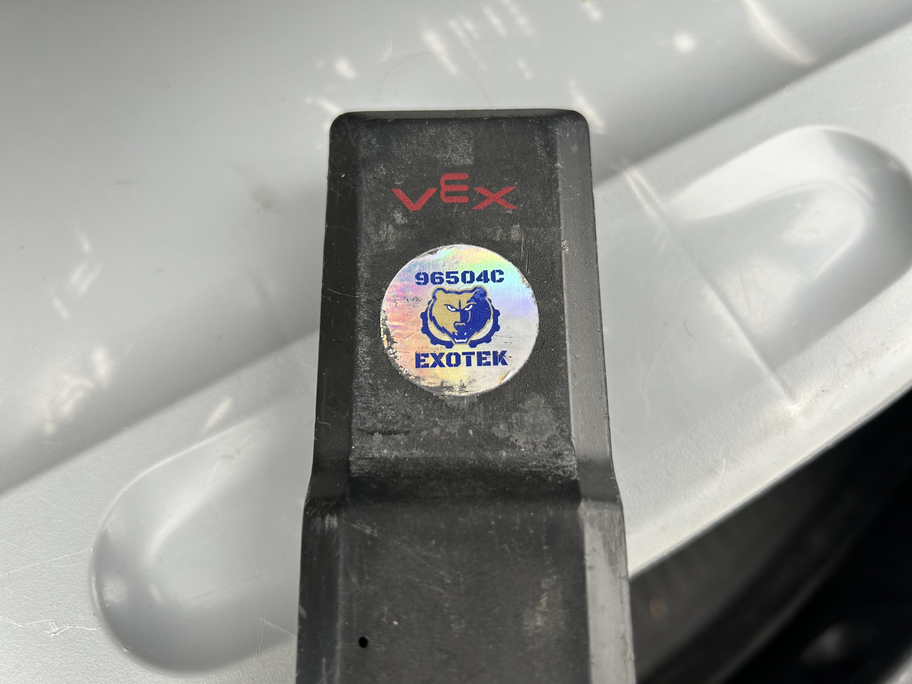

# 🚋 Resource Management

Truly, your team and your time are your most important resources. But, in this section, we will go over resource management in a different sense--as it relates to physical resources like metal and motors.

### Label your parts

Label all valuable electronic components, so they don't get lost, including:

* Batteries
* Battery chargers
* Brains
* Motors

Usually, if you lose a battery at a competition but have your team number on it, then some kind soul will return it to your team.

<figure><figcaption>
This label has saved our battery more than once!
</figcaption></figure>

### Organize your parts

Of course! The benefits of organization are obvious; nobody wants to dig around in a box for a few minutes just to find the right screw. But seriously, organize your parts! There are many great, cheap plastic storage containers on Amazon. Many teams also use the Robosource box or heavy duty organizers with wheels.

###
