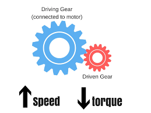

# ⚙️ Torque

#### What is Torque?

Torque is a vector which means its has a magnitude and a direction. At its most basic level is _a measure of the force that can cause an object to rotate about an axis._ Just like force causes an object to accelerate in linear kinematics torque causes an object to accelerate in angular kinematics       &#x20;

How do we calculate torque?

The formula to calculate the magnitude of torque is given as:

$$
τ = F *dsin(θ)
$$

where:

* τ is the torque
* F is the force applied to the rotating object
* d is the distance of the applied force from the point of rotation&#x20;
* θ is the angle of the applied vector force in relation to the rotating arm. This arm is also known as the moment arm

The concept of torque is essential in robotics as it is a fundamental of motors, gears, and levers which are used to transmit power and motion. To drive the robot you need to torque to accelerate, hold a top speed and to push other opponents. It is also needed to lift heavier objects faster and while keeping the speed of the robot.

**Torque Calculator**&#x20;


If you can't figure out what θ should be, it's probably 90 degrees


**Alternate Link:** [**https://html-7159868.codehs.me/torque.html**](https://html-7159868.codehs.me/torque.html)

**Gear Ratios**

Gears are obviously a very important part of how a robot moves and its functions work, however when using gears calculations have to made to determine the gear ratio.

As shown in the example below, there is usually one gear driving and then the rest are driven by that gear. In this scenario like many there is one smaller gear and another larger one.

<figure><figcaption></figcaption></figure>

 

<figure><figcaption></figcaption></figure>

The gears in VEX are always made in proportion to the number of teeth. The ratio of the teeth in each gear is known as the gear ratio and this is determined based on the ratio of speed to torque that is needed. With gears the speed and torque are inversely related. As shown in the diagram, when the driving gear is larger (has more teeth) than the driven gear the speed is increased however the torque is decrease. The same is true vice versa. When the smaller gear is driving, the torque is increased and the speed is decreased.&#x20;

This ratio is calculated using the following formula:

GEAR RATIO = (TEETH OF DRIVING GEAR) / (TEETH OF DRIVEN GEAR)

If the ratio is between 0 and 1, then the gear system has a torque advantage, but if the gear ratio is greater than 1, it has a speed advantage. Having a good balance between speed and torque is an important part of VEX Robotics.

