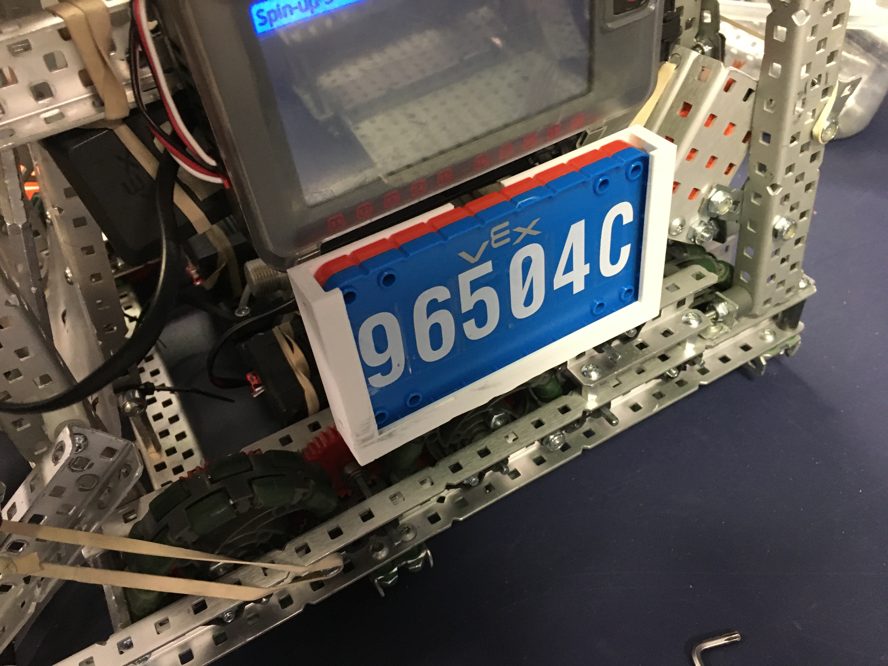

# 🖨️ 3D Printing

Unfortunately, 3D-printed parts with a function are not permitted on the robot. However, you are allowed to have decorations or license plate holders that are 3D-printed.

In fact, we strongly recommend these license plate holders, because they make it very easy to change colors between matches, saving time.

<figure><figcaption>
3D printed license plate holder
</figcaption></figure>

Here's the file; no supports are needed when 3D printing it.



