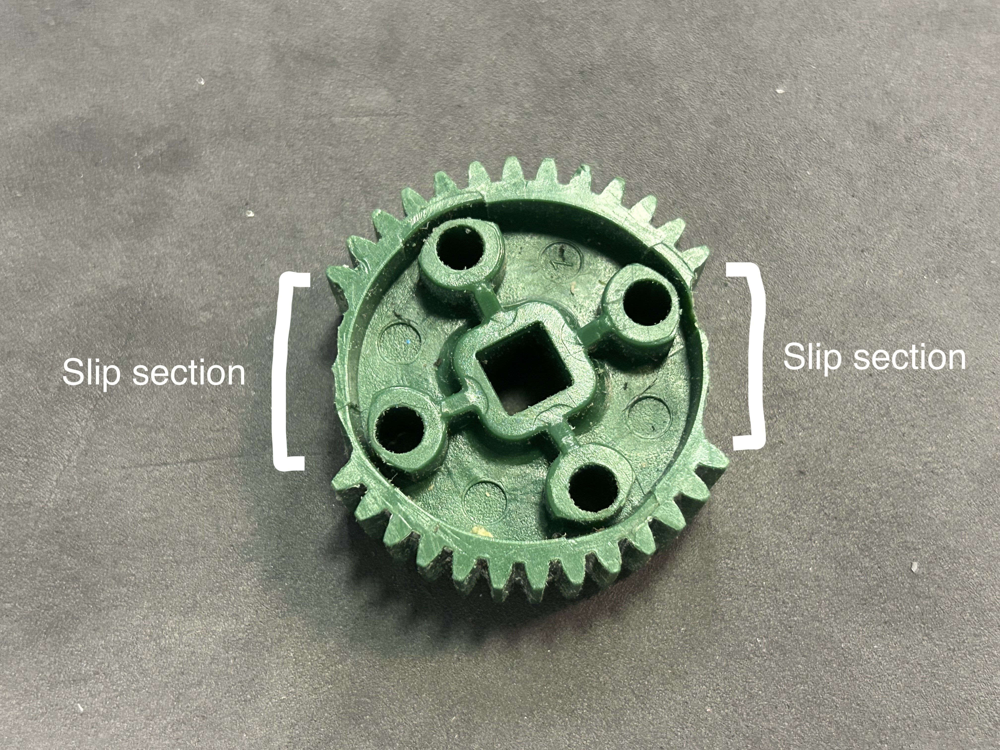

# 🏹 Catapults

Catapults are a common launching mechanism. They are simple, easy to build, and quite effective at launching all sorts of game objects.

Before we can get started with catapults, we first have to go over slip gears. These are gears with either one or two sections of teeth shaved off, like so:

<figure><figcaption></figcaption></figure>

The simplest catapult possible is a slip gear directly linked to a catapult arm. The slip gear pulls back the catapult to a certain point with the teeth that are on it. Then, when the section of the slip gear with the teeth shaved off reaches the gear on the catapult, the two gears disengage. At that point, the rubber bands on the catapult launch it forwards, along with any game object on the catapult.

Here's a demonstration, courtesy of team 491A and the Purdue Sigbots Wiki:


