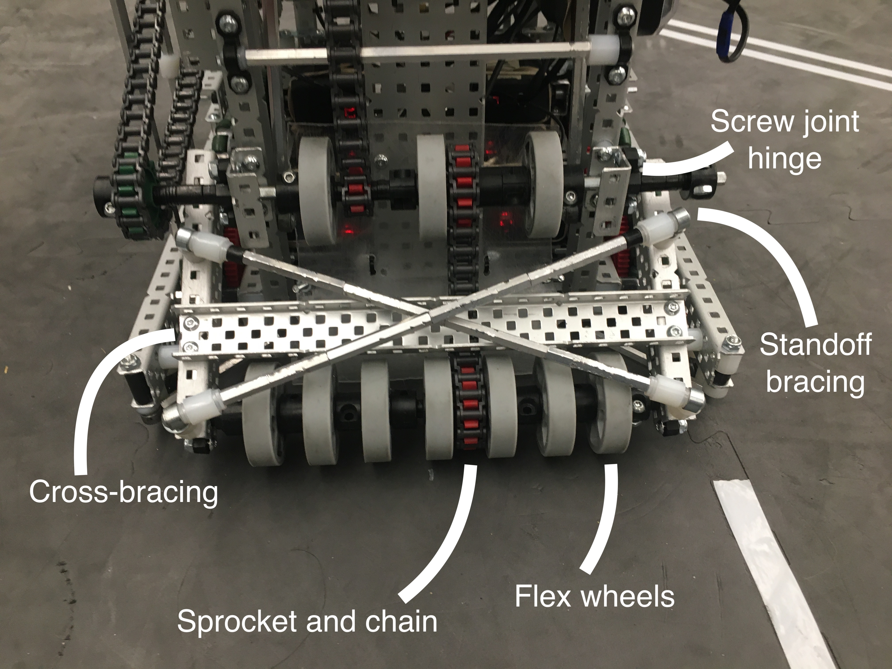
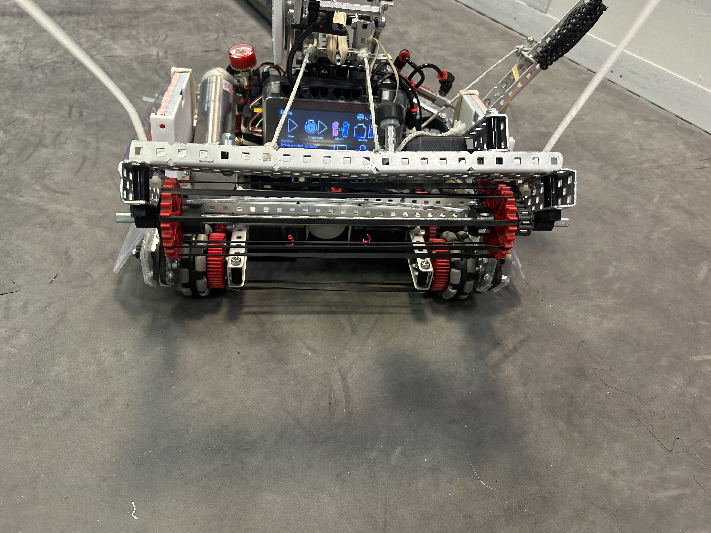

# 🎣 Intakes

Intakes are mechanisms designed to pick up different game objects and put them into a robot. There are a wide variety of intakes, and we'll show you a few of them here.

The first common type of intake uses an array of flex wheels on a rotating arm. Flex wheels have a lot of grip, which makes them good at grabbing game objects. Additionally, the flex wheels can lift up and down, allowing game objects to come into the robot. Note the cross-bracing and C-channel across the intake that stabilizes it.

<figure><figcaption>
Simple Spin Up intake
</figcaption></figure>

Here's another example of a flex wheel intake, but this one is vertical instead of horizontal:

<figure><figcaption>
Image: 62A, BLRS wiki
</figcaption></figure>

Another common type of intake uses rubber bands wrapped around sprockets as shown below. Rubber bands conform to the shape of the object in the intake more than flex wheels do, which can be helpful depending on the game object and intake spacing.

<figure><figcaption></figcaption></figure>

While flex wheels and rubber band sprockets are the majority of intakes, teams can also wrap a single layer of anti-slip mat around a rubber band intake for better durability.
