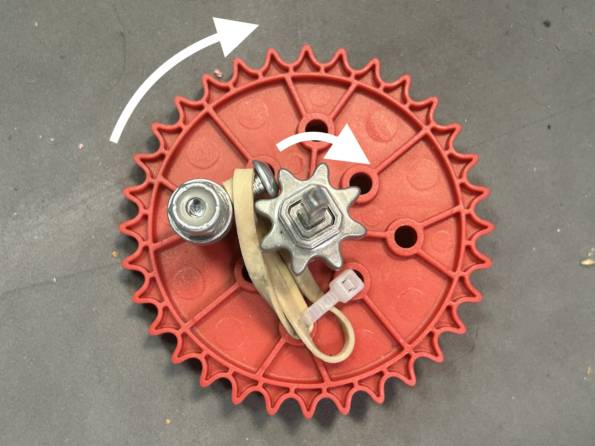
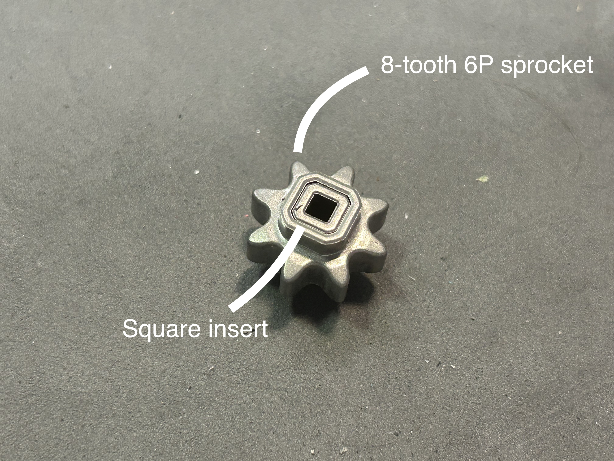
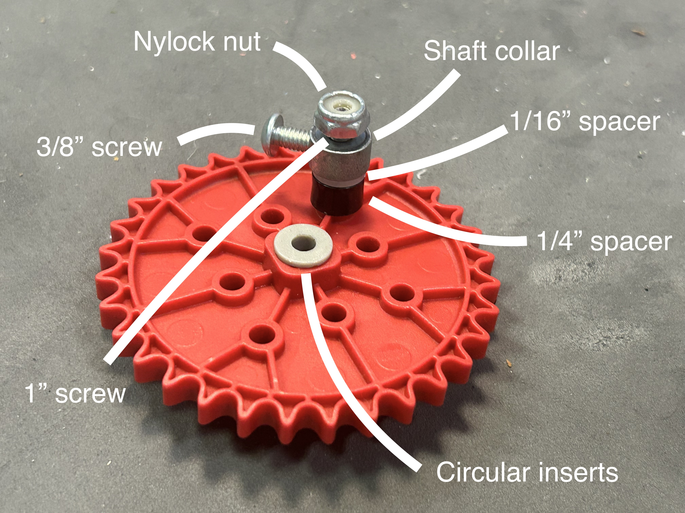
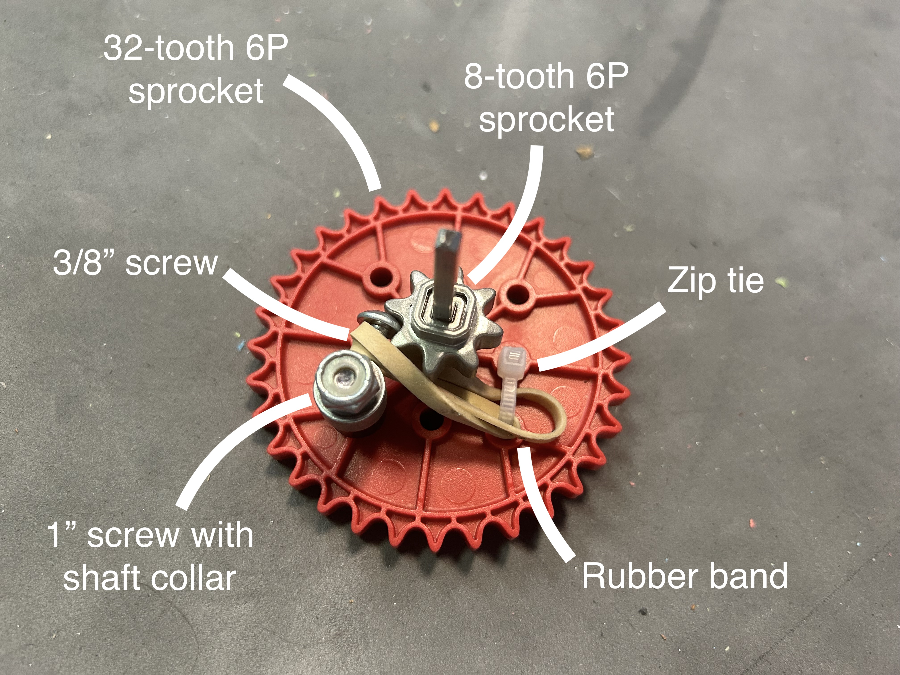

# ↔️ Ratchets

Ratchets allow certain mechanisms on the robot to only activate when a motor spins in one direction. By combining multiple ratchets, a team can add more functionality to their robot.

The basic premise of a ratchet is that a gear or sprocket is attached to a shaft such that it can spin freely around it. When the shaft rotates, the gear or sprocket does not necessarily rotate with it.&#x20;

There is also a smaller gear, right next to the primary gear/sprocket that does rotate with the shaft. A small screw on the primary gear/sprocket is then rubber banded so that it "catches" on the smaller sprocket when it turns in one direction, but not in the other.

<figure><figcaption>
Outer sprocket rotates; the shaft does too
</figcaption></figure>

 

<figure><figcaption>
Outer sprocket rotates; the shaft stays still
</figcaption></figure>

To build a simple ratchet, first obtain and assemble the following. Note that a 6-tooth 8P sprocket will usually work for the smaller gear. Additional testing might be required to find the best spacing on the screw in the picture to the right. Also, the larger sprocket can be swapped out for a gear.

<figure><figcaption></figcaption></figure>

 

<figure><figcaption>
Make sure to use the circular inserts!
</figcaption></figure>

Now, put both of the above sprockets on the same shaft. The next step is to zip tie a small rubber band to the large sprocket, as shown below, and wrap it around the screw. This keeps the screw locked into the smaller sprocket when the axle is turning.

<figure><figcaption></figcaption></figure>
