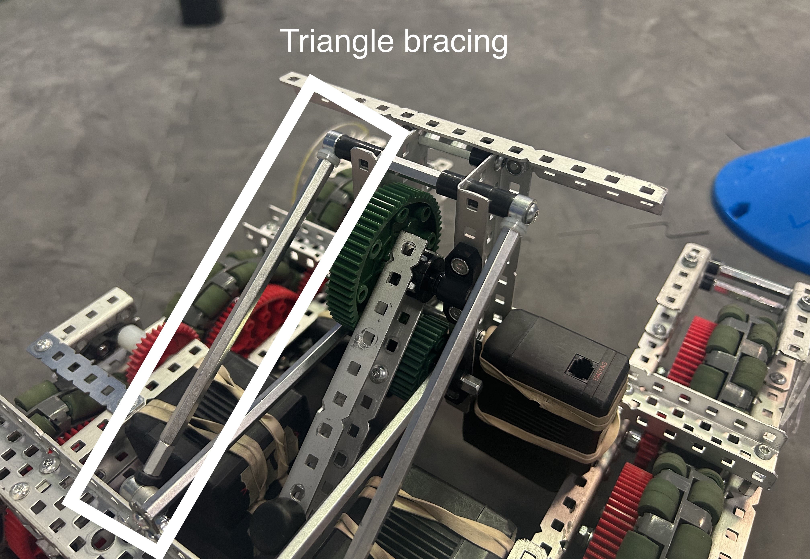
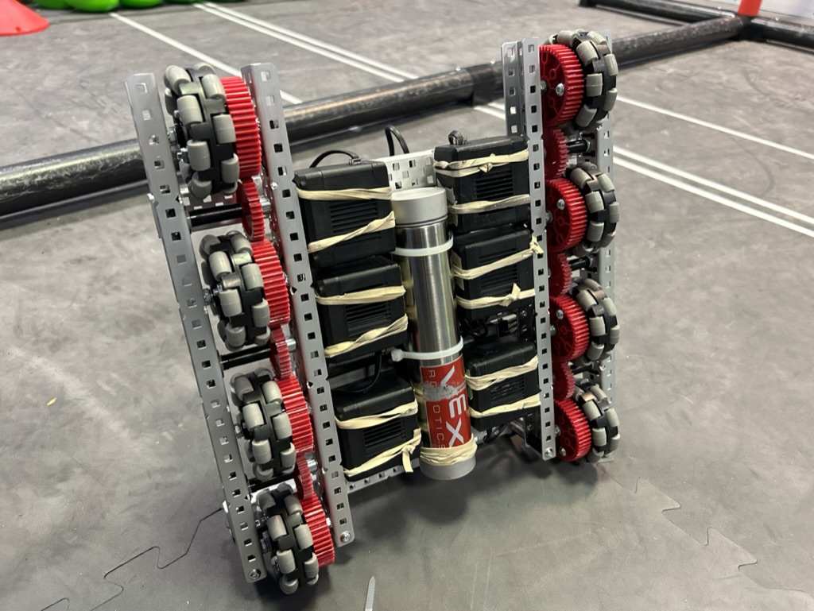
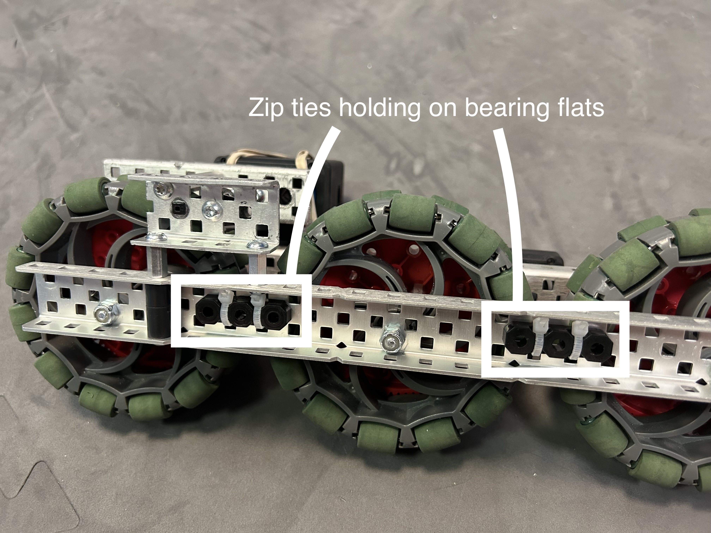

# 🔧 Best Practices

In Vex, there are many techniques to build well. The goal is to allow the robot to **last** multiple competitions without breaking while keeping it as **light** as possible.

### Triangle Bracing

Triangle bracing uses standoffs at odd angles to brace higher points on the robot. This greatly improves the stability of the higher mechanisms on the robot. In the picture below, the tower in the middle of the robot will not bend over time due to the triangle bracing.

<figure><figcaption></figcaption></figure>

For this type of bracing, we recommend using shaft collars screwed into each other and into standoffs like so:

<figure><figcaption>
Note how the shaft collars are oriented
</figcaption></figure>

### Lighter is Better

Lighter robots move faster and can usually outscore heavy robots.&#x20;

To save weight, always use the thin nylock nuts. They are about 50% lighter, which adds up when hundreds of them are used across the robot.

Additionally, always use aluminum metal to build the robot. Vex also offers steel, which is 50% stronger. However, it is also 136% heavier--not worth it.

Here's the same C-channel in both aluminum (left) and steel (right) varieties. Note the massive weight difference between the two pieces!

<figure><figcaption></figcaption></figure>

 

<figure><figcaption></figcaption></figure>

### Center of Gravity

Ideally, the center of gravity should be two things:

* Low: prevents the robot from tipping over
* Centered: makes autonomous routines more accurate

Practically, this means that the bulk of the weight on your robot should be as low as possible. Additionally, try to have some balance in the weight distribution side-to-side. For example, mount the brain/battery and the air tanks on opposite sides of the robot to balance it out.

<figure><figcaption>
Note how all 6 drive motors and the air tank are as low as possible
</figcaption></figure>

### Zip ties!

Zip ties are the duct tape of Vex Robotics. They work well in a pinch for meager structural support, but they don't hold up in high-stress situations. One good application of zip ties is on bearing flats for the drivetrain. That's because the bearing flats are not under any lateral stress. Additionally, this saves weight compared to the alternative (screws and nuts).

<figure><figcaption>
This should not be viable, but it is
</figcaption></figure>

Using zip ties instead of screws and nuts to attach bearing flats saves about 0.01 pounds per bearing flat. If you use 20 bearing flats on the robot in total, you can save 0.2 pounds of weight on the robot. Every little bit of weight reduction matters.

<table><thead><tr><th width="306.3333333333333">Bearing flat attachment method</th><th>Weight</th></tr></thead><tbody><tr><td>Zip ties</td><td>0.001 lbs</td></tr><tr><td>Screws and nuts</td><td>0.011 lbs</td></tr></tbody></table>

However, zip ties should not be used for high-stress or pivotal connections, as they are prone to break over time.
