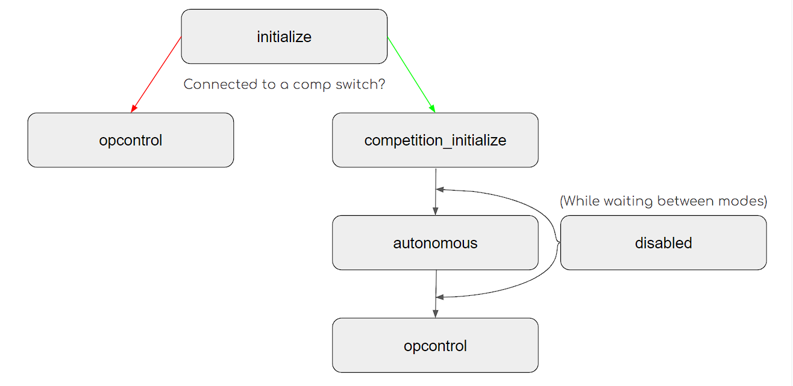
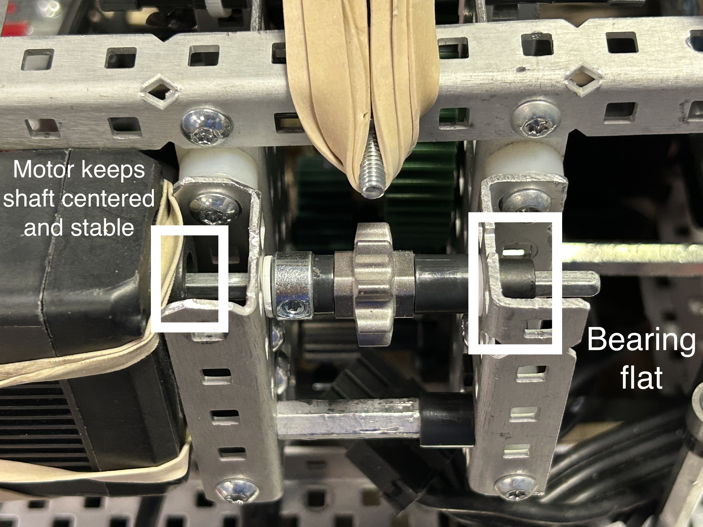
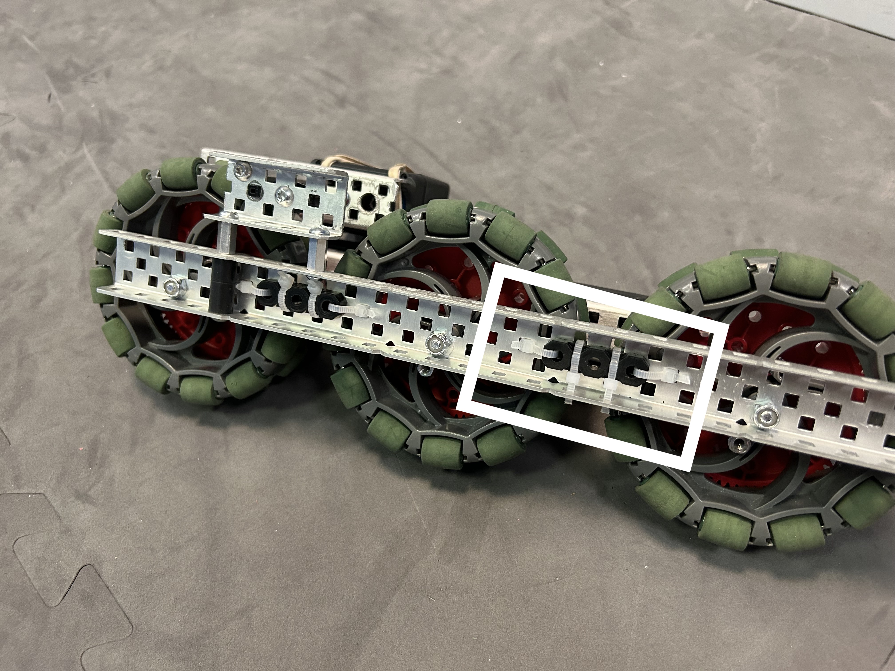

# 🔵 Bearing flats

It turns out that the square holes in vex metal pieces aren't a great fit for a rotating axle. Yes, they technically work, but the axle is highly unstable, and the friction is egregious.

<figure><figcaption>
Note the shape of the hole in the metal
</figcaption></figure>

The solution? Bearing flats! Bearing flats are essential for having low-friction drivetrains, and also for other mechanisms on the robot. They keep shafts aligned to the center of the hole, preventing it from touching the metal (which adds friction) or wobbling.

<figure><figcaption></figcaption></figure>

Bearing flats should be used on either side of an axle to support it and reduce friction. However, a motor also supports the axle, so there is no need for a bearing flat right next to a motor:

<figure><figcaption></figcaption></figure>

On the drivetrain, bearing flats should be used for both axle and screw joints (as possible), since they do reduce friction. For example, in the drivetrain below, the motor shafts have one bearing flat on the outside to keep the motor axle stable.&#x20;

<figure><figcaption>
Note the zip ties. Yes, this works, and it works well!
</figcaption></figure>

