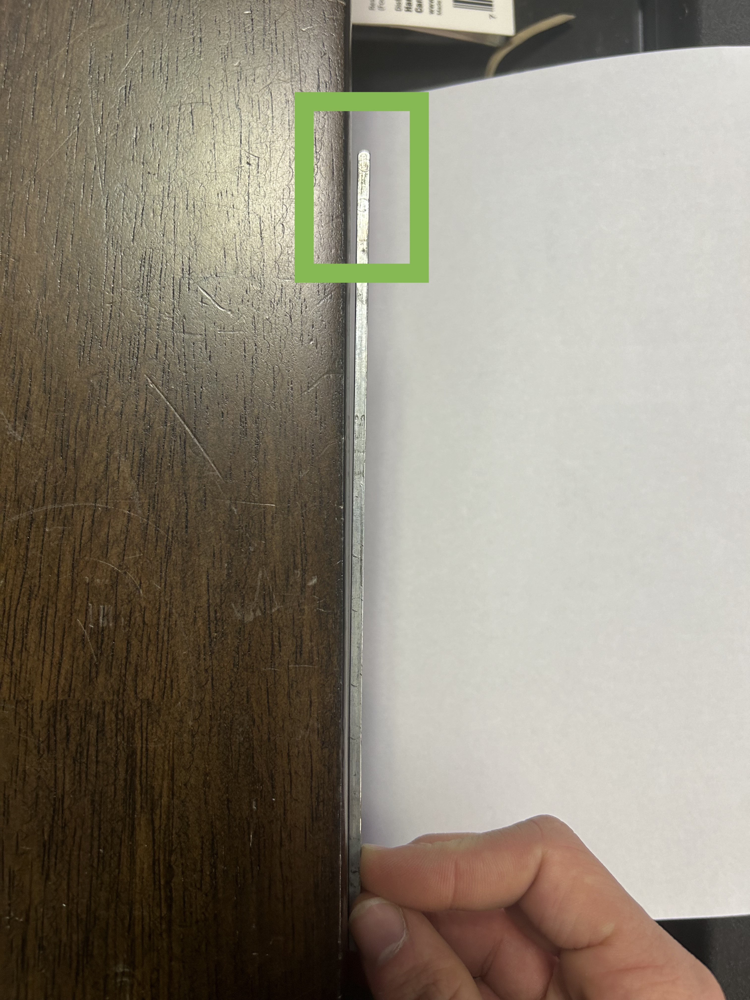
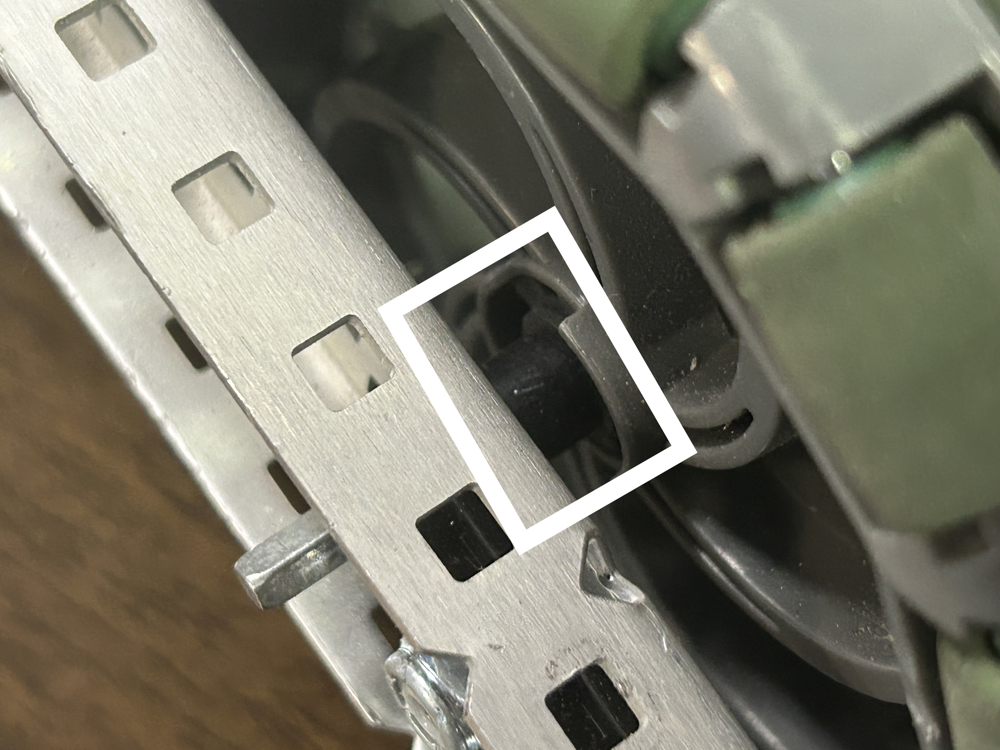
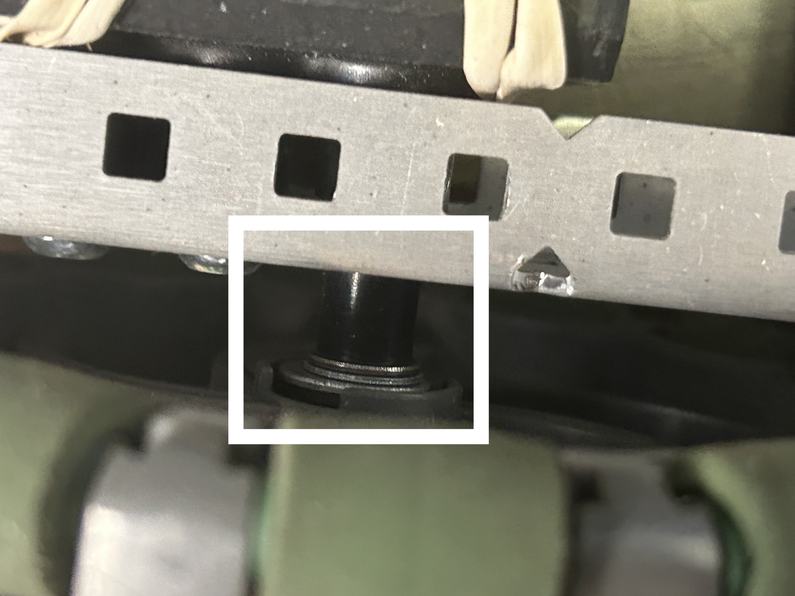
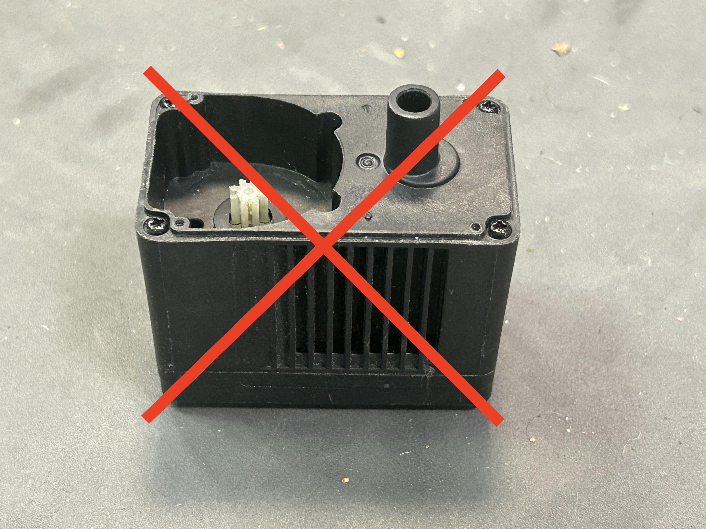

# 🛤️ Fixing Friction

Friction on the drivetrain can be caused by any number of issues.&#x20;

## Testing Friction

Luckily, it's relatively easy to test drivetrain friction. Attach all of the gears and wheels, but not the motors and motor cartridges, like so:

<figure><figcaption></figcaption></figure>

Then, give the drivetrain a good spin with your hand, as fast as you can. The drivetrain should keep spinning for at least:

* 3 seconds, if you have **axle** joints
* 5 seconds, if you have **screw** joints

This is called the freespin time, and it's a great way to test the friction on the drivetrain. The longer the freespin time, the less friction there is.

## Fixing Friction

If the freespin time on the robot is longer than acceptable, there is friction somewhere. Here's a few potential sources of friction:

### Bent axles

If the drive axles are bent, then nothing else can really work. To test if an axle is bent, press it  against something you know is flat and look for a gap between the axle and the flat surface. Do this for all four sides of the axle.

<figure><figcaption>
Note the gap between the wooden table and the axle
</figcaption></figure>

If it is bent, then simply replace the axle and throw away the old one. There's no reason to keep bent axles around.

### Tight spacing

On either axles or screws, too much spacing can cause friction issues. That's because the spacers rub against the drive C-channel, which adds resistance and extra friction. The wheel should be axle to wobble back and forth on the axle/screw by about 0.25 mm. If it can't wobble a little, then likely the spacing is too tight. Remove some of the spacers and replace them with shorter ones.

<figure><figcaption></figcaption></figure>

 

<figure><figcaption></figcaption></figure>

In the images above, there isn't a small gap anywhere along the axle. Thus, the spacing is too tight; this will cause friction issues. In this case, removing a washer would be the best way to fix it.

### Misaligned drive C-channels

If the drive C-channels are even slightly misaligned, then that can cause friction because the axles won't be perfectly perpendicular to the inside face of the drive C-channels. Make sure to [square your chassis](https://ascendrobotics.gitbook.io/ascend/vex-robotics/building/drive-trains#additional-resources) before you start building the drivetrain to resolve this problem.

### Extraneous shaft collars

Shaft collars are essential in VEX Robotics. However, there should never be shaft collars on the outside of the drive C-channels--they only cause extra friction. One shaft collar on the inside of an axle is enough to lock it in place.

### Bad bearing flats

Sometimes, bearing flats go bad or can become misaligned with the holes in C-channels. If a bearing flat seems to be causing a problem, try replacing it.

### Bad motor cartridges / motors

Make sure to test each motor before putting it on the drivetrain. Ideally, each motor (with the motor cartridge in) should not draw more than 0.1 - 0.2 watts of power at max speed. Use the "devices" screen on the brain to test the motor, and if it draws more than 0.2 watts of power, try to find a different motor with less internal friction. Additionally, make sure to test each cartridge as well. Bad motors and cartridges ruin a good drivetrain.

<figure><figcaption></figcaption></figure>

