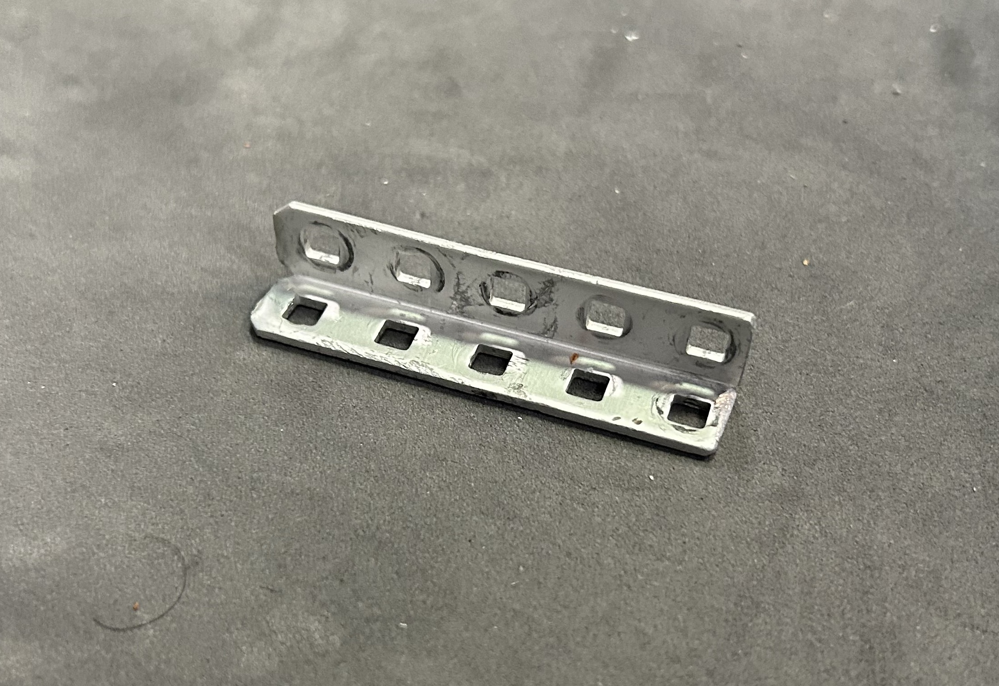
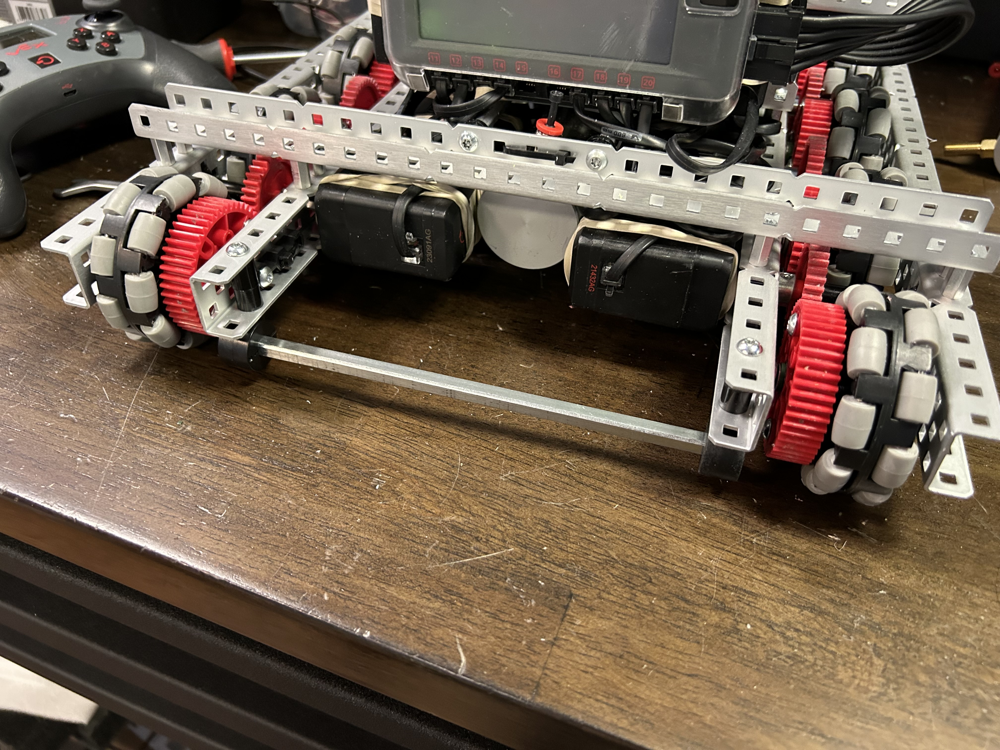

# 🪨 Metal

The basic structure of every VEX robot uses metal. Specifically, aluminum C-channels are used to construct the chassis and other mechanisms on the robot. These C-channels are relatively lightweight, yet still are very resistant to deformation under stress.

<figure><figcaption>
Standard 1x2x1x25 C-channel
</figcaption></figure>

Here's a few  other types of metal structure available:

<figure><figcaption>
5-wide C-channel
</figcaption></figure> <figure><figcaption>
2x2 L-channel
</figcaption></figure> <figure><figcaption>
3-wide C-channel
</figcaption></figure>

However, sometimes a C-channel is overkill for applications on a robot. By cutting a C-channel in half (the long way), you can form 1-by L-channels like the following:

<figure><figcaption></figcaption></figure>

These L-channels are good for areas of the robot that aren't under a lot of stress. That's because they're very light, but also less robust than a C-channel.

However, teams have innovated ways to use other metal pieces for support. For example, high strength shafts are exceptionally durable and highly resistant to bending. They can be attached using the shaft collars or by drilling holes through the shaft.&#x20;

<figure><figcaption>
The shaft acts as a cross-brace and helps hold game objects.
</figcaption></figure>
