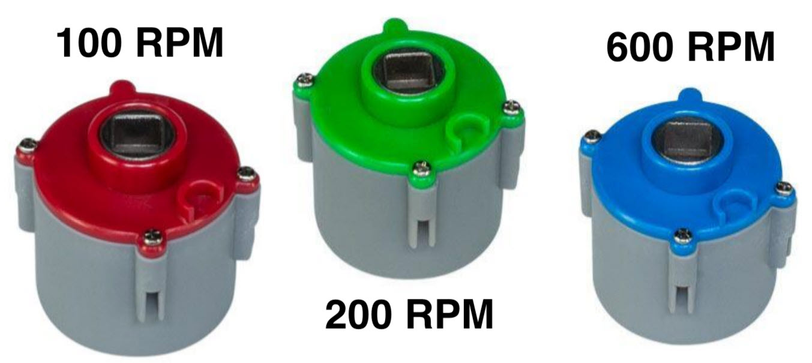
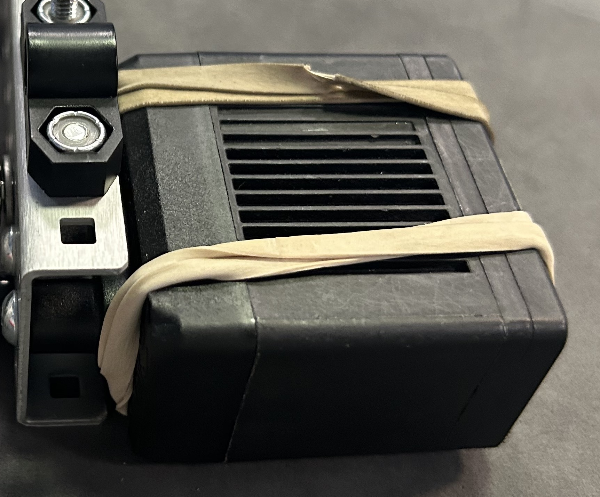

# 🏍️ Motors

Motors are an essential part of VEX Robotics, as they convert the chemical energy stored in the battery into usable mechanical energy. There are two types of motors: 11-watt (11W) and 5.5-watt (5.5W) motors.&#x20;

## 11W motors

Specifications:

* Power: 11 Watts
* Torque: 2.1 N⋅m
* Weight: 0.342 lbs or 155 grams

 (1).png>)

## 5.5W motors

Specifications:

* Power: 5.5 Watts
* Torque:  1.3 N⋅m
* Weight: 0.20 lbs or 91 grams

 (1).png>)

Each robot is allowed 88W of motor power total. Here's a table showing some possible combinations of motors that can be used on the robot:

<table><thead><tr><th># 11W motors</th><th># 5.5W motors</th><th data-hidden></th></tr></thead><tbody><tr><td>8</td><td>0</td><td></td></tr><tr><td>7</td><td>2</td><td></td></tr><tr><td>6</td><td>4</td><td></td></tr><tr><td>...</td><td>...</td><td></td></tr></tbody></table>

### Motor Cartridges

There are three types of motor cartridges for the 11W motors. Each one spins at a different RPM as shown below:

<figure><figcaption></figcaption></figure>

### Hot Swapping

Hot swapping allows teams to change out broken or overheated motors for good ones without having to unscrew the motor cap (an arduous process). Hot swappable motors have rubber bands that keep the motor body secured to the motor. To make a motor hot swappable, remove the four screws that keep the motor cap secured to the motor body. Then, wrap two rubber bands around the motor as shown in the picture below. Make sure the motor is securely in place, and replace the rubber bands regularly.

<figure><figcaption>
Example hot swap
</figcaption></figure>
