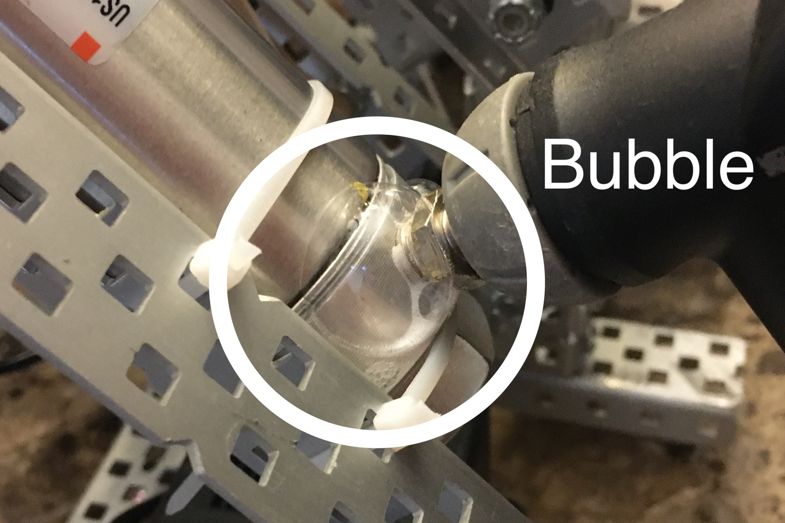

# 🎈 Pneumatics

In Vex Robotics, teams can use two things to do active mechanical work: motors and pneumatics. Pneumatics use the power of compressed air to activate mechanisms on the robot. However, each actuation uses up a little bit of air each time, so the force from pneumatics slowly decreases throughout a match. Despite this, they are very useful in a variety of mechanisms.

For example, here's a pneumatic that is used to activate wings on an VEX Over Under robot:

<figure><figcaption></figcaption></figure>

To set up a basic pneumatic system, you need three components:

* Air tank: Stores compressed air
* Solenoid: Directs compressed air
* Piston: Uses compressed air

Here's a simple pneumatic system. In summary, compressed air is stored in the air tank to the left, and then directed by the solenoid to either expand or contract the piston. The air tank is filled up with a bicycle pump or air compressor through the Schrader valve. From there, pneumatic tubing connects it to the double-acting solenoid. The solenoid directs the air to one of two output valves that lead to the two sides of the piston. Also, there's a plug in the right side of the solenoid to prevent the air from coming out of the system.

<figure><figcaption>
Simple pneumatic system setup (the new pneumatics)
</figcaption></figure>

For information on how to code the pneumatic system, check out this page:


[coding-pneumatics.md](../coding/vexcode-pro/coding-pneumatics.md)


### Best Practices

Here's a few tips to keep in mind while building with pneumatics:

* Keep the air hose between the solenoid and pneumatic piston as short as possible, to minimize the amount of air lost in each actuation.
* Pneumatic pistons are designed to withstand an incredible amount of force parallel to the direction they extend in, but they are not designed to resist bending.&#x20;
*   Tighten each valve fitting all the way to prevent leaks. If there is a leak, and you can't find where, apply a small amount of soapy water to each valve fitting connection. If the soapy water starts to  bubble at a valve fitting, then air is leaking there.

    <figure><figcaption>
So, that's where the leak is!
</figcaption></figure>
