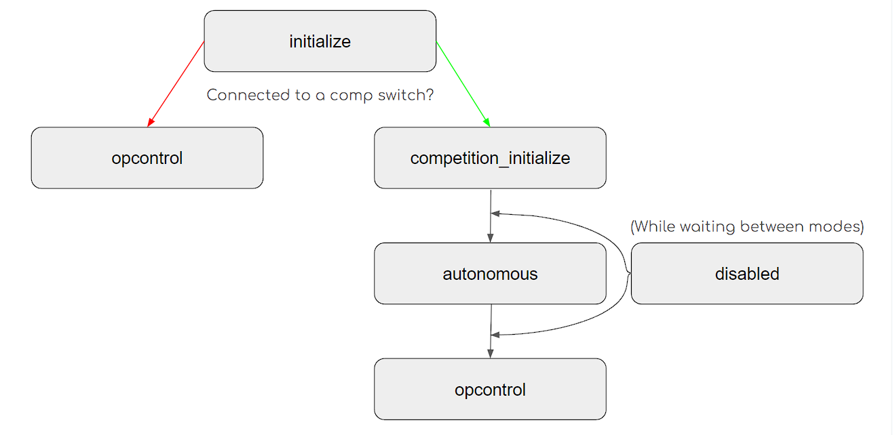

# 🟡 PROS

[PROS ](https://pros.cs.purdue.edu/v5/index.html)(Purdue Robotics Operating System) is an open-source alternative to VEXCode created by Purdue students and supported by VEX. While it may be more difficult to use in some ways, it also has more freedom and supports a wider variety of community software like templates and utilities.

First, download [Visual Studio Code](https://code.visualstudio.com/) and install it. Open it up, go to extensions, and download the PROS extension and C/C++ extension.

<figure><figcaption></figcaption></figure>

<figure><figcaption></figcaption></figure>

Before we proceed, the following extensions are recommended but not required, so you can choose to download them or not:

* C/C++ Themes
* Clang-Format
* clangd
* Doxygen Documentation Generator
* file-icons

## Starting a New Project

Go ahead and open up VScode, go to the PROS extension and hit "Create Project," which should look like this:

<figure><figcaption></figcaption></figure>

Then enter a project name, choose the V5 option and select the latest version


Both PROS 3.8 and PROS 4 are widely used, but the PROS 4 documentation and community support is now at a point where I would go ahead recommend using it.


When the new project opens up, you will see a couple folders:

<figure><figcaption></figcaption></figure>

**Quick Breakdown**

📁 **.d** - don't touch, don't worry

📁 **.vscode** - pretty much just cofiguring vscode, shouldn't worry about it for the most part

📁 **bin** - compile stuff done by PROS, don't touch, don't worry

📁 **firmware** - don't touch, don't worry

📁 **include** - this is where you will put the header files (.h and .hpp) for libraries you use and for your code&#x20;

📁 **src** - where you will work 95% of the time, for c and c++ files

**.gitignore** - used for telling GitHub what not to upload

**common.mk** - don't touch, don't worry

**compile\_commands** - 99.999% of the time don't touch, don't worry

**Makefile** - useful if you want to make a library, don't touch, don't worry otherwise

**project.pros** - where to change the project name, description, slot on brain, and icon


After creating the new project, open up main.cpp and delete everything except the signatures for  initialize, disabled, competition\_initialize, autonomous and opcontrol and their associated comments.&#x20;

## Breaking Up Your Main.cpp File

While not required, I would recommend keeping as much code in your main.cpp file as possible to make your life easy. To keep everything organized, you can break your file up into 4 sections using comment blocks:

* Device Setup
* Custom Functions
* Autonomous Programs
* Vex Functions

&#x20;At this point, your code should look something like this:

```cpp
#include "main.h" // header file containing everything

using namespace pros; // pretty much means you dont have to write pros:: a bunch

/*****************************************
 * 
 * 
 * 
 *   SETUP
 * 
 * 
 * 
******************************************/

/*****************************************
 * 
 * 
 * 
 *   CUSTOM FUNCTIONS
 * 
 * 
 * 
******************************************/

/*****************************************
 * 
 * 
 * 
 *   AUTONOMOUS ROUTES
 * 
 * 
 * 
******************************************/

/*****************************************
 * 
 * 
 * 
 *   VEX FUNCTIONS
 * 
 * 
 * 
******************************************/

/**
 * Runs initialization code. This occurs as soon as the program is started.
 *
 * All other competition modes are blocked by initialize; it is recommended
 * to keep execution time for this mode under a few seconds.
 */
void initialize() {
}

/**
 * Runs while the robot is in the disabled state of Field Management System or
 * the VEX Competition Switch, following either autonomous or opcontrol. When
 * the robot is enabled, this task will exit.
 */
void disabled() {}

/**
 * Runs after initialize(), and before autonomous when connected to the Field
 * Management System or the VEX Competition Switch. This is intended for
 * competition-specific initialization routines, such as an autonomous selector
 * on the LCD.
 *
 * This task will exit when the robot is enabled and autonomous or opcontrol
 * starts.
 */
void competition_initialize() {}

/**
 * Runs the user autonomous code. This function will be started in its own task
 * with the default priority and stack size whenever the robot is enabled via
 * the Field Management System or the VEX Competition Switch in the autonomous
 * mode. Alternatively, this function may be called in initialize or opcontrol
 * for non-competition testing purposes.
 *
 * If the robot is disabled or communications is lost, the autonomous task
 * will be stopped. Re-enabling the robot will restart the task, not re-start it
 * from where it left off.
 */
void autonomous() {}

/**
 * Runs the operator control code. This function will be started in its own task
 * with the default priority and stack size whenever the robot is enabled via
 * the Field Management System or the VEX Competition Switch in the operator
 * control mode.
 *
 * If no competition control is connected, this function will run immediately
 * following initialize().
 *
 * If the robot is disabled or communications is lost, the
 * operator control task will be stopped. Re-enabling the robot will restart the
 * task, not resume it from where it left off.
 */
void opcontrol() {}

```


### Device Setup

In V5RC, you will use a number of different devices, such as motors, sensors, and pneumatics. I will go through the basics, but as always, use the documentation, which is linked for each device.&#x20;

<table><thead><tr><th width="189">Device</th><th>Example</th></tr></thead><tbody><tr><td><a href="https://pros.cs.purdue.edu/v5/api/cpp/motors.html#constructor-s">Motor</a></td><td> </td></tr><tr><td><a href="https://pros.cs.purdue.edu/v5/api/cpp/misc.html#pros-controller">Controller</a></td><td></td></tr><tr><td><a href="https://pros.cs.purdue.edu/v5/api/cpp/optical.html">Optical Sensor</a></td><td></td></tr><tr><td><a href="https://pros.cs.purdue.edu/v5/api/cpp/distance.html">Distance Sensor</a></td><td></td></tr><tr><td><a href="https://pros.cs.purdue.edu/v5/api/cpp/imu.html">Inertial Sensor</a></td><td></td></tr><tr><td><a href="https://pros.cs.purdue.edu/v5/api/cpp/adi.html#pros-adidigitalout">Pneumatics</a></td><td></td></tr></tbody></table>

```cpp
/*****************************************
 * 
 * 
 * 
 *   SETUP
 * 
 * 
 * 
******************************************/

Controller controller1(CONTROLLER_MASTER);

// you will have to determine whether each motor needs to be reversed or not
// depending on the orientation of the motors on your robot
Motor m1(1, E_MOTOR_GEAR_600, 0);
Motor m2(2, E_MOTOR_GEAR_600, 0);
Motor m3(3, E_MOTOR_GEAR_600, 0);
Motor m4(4, E_MOTOR_GEAR_600, 0);
Motor m5(5, E_MOTOR_GEAR_600, 0);
Motor m6(6, E_MOTOR_GEAR_600, 0);

// you may or may not use these sensors on your robot, just delete what you dont need
Optical opt1(7);
Distance dist1(8);
Imu inr1(9);

// note that the code interacts with the solenoid, not the piston so one object 
//could represent two pistons
ADIDigitalOut solenoid1('a');

```


### Custom Functions

This is where you will write utility functions that you will use throughout the rest of your code, such as a function to move the robot a certain distance or active an arm. This is also a great place to put PIDs and other control loops (see the [Coding PIDs](vexcode-pro/advanced/coding-pids/) section). Some people also put their driver control function at the bottom of this section.


### Autonomous Routes

This is where you will store the pathing and commands for each autonomous route you have. Each route can be stored in a void function and run during the autonomous period.&#x20;


### VEX Functions

This is where you will keep the VEX functions that are essential to make the program and robot work. The comments above each "mode" the robot jumps through explain them well, but below is a diagram that shows the flow of "modes."

<figure><figcaption></figcaption></figure>

You can also simulate being connected to a competition switch using the competition mode on the VEX controllers.

#### Initialize

Under the initialize method, we need to do things like initialize the brain screen, turn on sensors and set up tasks (see the [Tasks](vexcode-pro/advanced/tasks.md) section). Basically these are the things that will happen every time the robot turns on regardless of the circumstances.&#x20;

```cpp
void initialize() {
	lcd::initialize(); // initializes the brain screen
	OPT1.set_led_pwm(30); // sets the optical light to 3-%
	Task autoPuncherTask(autoPuncher); // an example task that 
					   // calls a separate method
}
```

#### Autonomous

This is where the autonomous routes will be called. This can be done using multiple versions of the program (easy) or create an auton selector (a little harder but recommended).&#x20;

#### Opcontrol

The opcontrol method is what is called during the 1:30 driver period. First, we need to initialize variables that we will use later.

<pre class="language-cpp"><code class="lang-cpp"><strong>// tune these values to change how fast the drive can move and turn
</strong><strong>float moveSpeed = .9;
</strong>float turnSpeed = .5;

// these values will change based on the joystick and be fed to the motors
float move;
float turn;
float left;
float right;
</code></pre>

We also need to set the drive motors' breaking modes. You can either choose to have them on coast (recommended) or brake.

```cpp
m1.set_brake_mode(E_MOTOR_BRAKE_COAST);
m2.set_brake_mode(E_MOTOR_BRAKE_COAST);
m3.set_brake_mode(E_MOTOR_BRAKE_COAST);
m4.set_brake_mode(E_MOTOR_BRAKE_COAST);
m5.set_brake_mode(E_MOTOR_BRAKE_COAST);
m6.set_brake_mode(E_MOTOR_BRAKE_COAST);
```

Now, create an infinite loop. This is where we will put the rest of the drive code and it will loop continuously until driver control ends.&#x20;

The infinite loop will have two main sections:

1\) **Button Checks**

Each button can be assigned a function using the following format:

```cpp
// toggle variable with "B" button
if (Controller1.get_digital_new_press(E_CONTROLLER_DIGITAL_B)) {
    variable = !variable;
}
```

You can either have a button activate once per press (get\_digital\_new\_press) or continually while its pressed (get\_digital).

2\) **Drive Control**

The example below is the most basic form of double arcade, feeds the joystick values into the left and right after being modified by the moveSpeed and turnSpeed variables created earlier.

<pre class="language-cpp"><code class="lang-cpp"><strong>// these variables capture the joystick values which are 
</strong><strong>// currently in a double arcade format
</strong><strong>move = Controller1.get_analog(ANALOG_LEFT_Y);
</strong>turn = Controller1.get_analog(ANALOG_RIGHT_X);

// this assigns the motor speeds to left and right variables
// by adding or subtracting the turning to the moving
left = (move * moveSpeed + turn * turnSpeed);
right = (move * moveSpeed - turn * turnSpeed);

// move drivetrain motors
m1.move(left);
m2.move(left);
m3.move(left);
m4.move(right);
m5.move(right);
m6.move(right);
</code></pre>


You can make several additional modifications to the drive code, such as adding curves and creating floors for turning speed.


Finally, at the end of the infinite loop, you MUST MUST MUST add a delay(20) to make sure the brain can keep braining.&#x20;


\[Coming soon: Tasking, PIDs, outside libraries]
