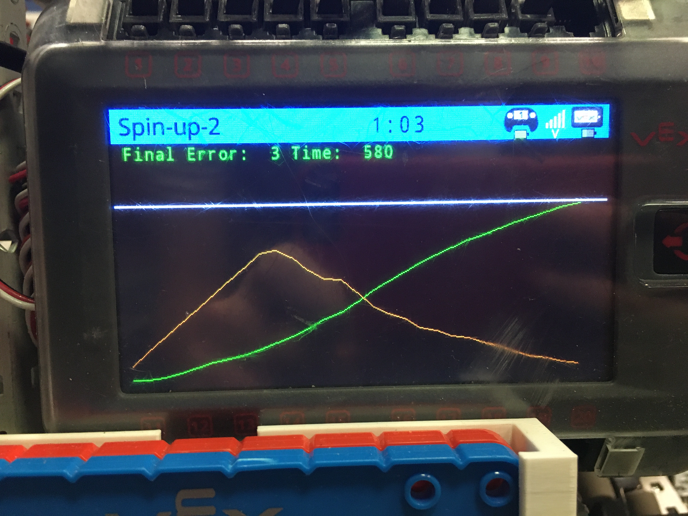

# 📊 Graphing PIDs

Graphing PIDs can be helpful when tuning them; it gives you a good idea of how quick and accurate the PID is.

In the graph below, the green line shows how far the robot is from the target point. The robot starts off far from the target point, but reaches it by the end of the graph. The orange line is the motor power, which initially increases sharply, but then decreases when the robot gets close to the target point so it doesn't overshoot.

<figure><figcaption><p>Here's our simple graph</p></figcaption></figure>

First of all, make sure you include a few libraries at the top of the main file.

```cpp
#include <cmath>  
#include <vector>
#include <cstdlib>
```

Next, here's the main graphing function. It clears the brain screen and draws a graph displaying the robot's progress towards the target, and the motor power too.

```cpp
//graphing data, used for PID tuning
void graphPID(std::vector<int> errorHistory, std::vector<float> powerHistory, int goal, float error, int time) {
  //goal is the PID goal (driveDistance)
  //error history is a list of all of the errors (range is 0 to driveDistance)
  //powerHistory is a list of the power applied (range is -1 to 1)
  //error is the current error
  //time is the current time, in milliseconds
  
  //Setup: clear screen and draw the target line
  Brain.Screen.clearScreen();
  Brain.Screen.setPenWidth(2);
  Brain.Screen.setPenColor(white);
  Brain.Screen.drawLine(0, 60, 480, 60);
  Brain.Screen.setPenWidth(1);
  Brain.Screen.setPenColor(green);

  //display final error and time
  Brain.Screen.setCursor(1, 1);
  Brain.Screen.clearLine(1);
  Brain.Screen.print(" Final Error: ");
  Brain.Screen.print(error);
  Brain.Screen.print("    Time: ");
  Brain.Screen.print(time);
  
  //define the borders of the graph
  int minY = 60; //error = 0 (robot is at target)
  int maxY = 230; //error = driveDistance (Robot is at start)
  int minX = 10; //time = beginning
  int maxX = 470; //time = end
  
  //loop through each data point and graph it
  for (int i = 0; i < errorHistory.size() - 1; i++) { 
    int x = minX + (maxX - minX) * i / errorHistory.size(); //find the x-value of this data point
    
    //graph velocity
    Brain.Screen.setPenColor(green);
    Brain.Screen.drawLine(x, minY + (float)errorHistory.at(i) / goal * (maxY - minY), x + (float)(maxX - minX) / errorHistory.size(), minY + (float)errorHistory.at(i + 1) / goal * (maxY - minY));
    
    //graph power, changing color based on direction
    if (powerHistory.at(i) > 0) {
      Brain.Screen.setPenColor(orange);
    } else {
      Brain.Screen.setPenColor(yellow);
    }
    
    Brain.Screen.drawLine(x, maxY - std::abs(powerHistory.at(i)) * (maxY - minY), x + (float)(maxX - minX) / errorHistory.size(), maxY - std::abs(powerHistory.at(i + 1)) * (maxY - minY));
  }
}
```

We've made the graphing function; now we just have to call it. But first, we need to log the error history and power history in the PID function. Put this code <mark style="color:green;">**in the PID function, before the while loop.**</mark>

```cpp
//lists
std::vector<int> errorHistory; //keep track of error over time
std::vector<float> powerHistory; //keep track of motor power over time
int currentTime = 0; //keep track of time over time (wow!)
```

Next, we'll update the history vectors with the current values, and then call the function. Put this code <mark style="color:green;">**in the PID function while loop, before the**</mark><mark style="color:green;">**&#x20;**</mark><mark style="color:green;">**`wait(20, msec);`**</mark><mark style="color:green;">**&#x20;**</mark><mark style="color:green;">**line**</mark>:

```cpp
//update histories and current time
errorHistory.push_back(error);
powerHistory.push_back(std::abs(motorPower));
currentTime += 20;

//graph the PIDs 
graphPID(errorHistory, powerHistory, driveDistance, error, currrentTime);
```

And with that, you should have a working graph while your PIDs are running! This graph can be used to make tuning the PIDs much easier, as it allows you to see the exact path of the robot to the target point.
