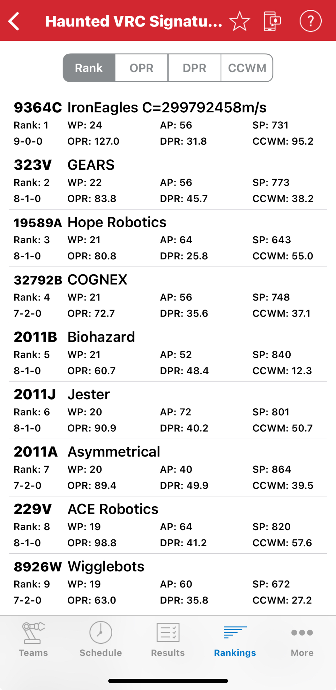

# ℹ️ Ranking and Stats

In tournaments, VEX Via reports a number of statistics: WP, AP, SP, OPR, DPR, and CCWM. These can seem confusing at first, but we'll go over what each one means here.

<figure><figcaption>
This is from Haunted 2023
</figcaption></figure>

## Ranking Stats

These determine your overall ranking going into Alliance selection.

#### WP (Win points)

Win points are the primary factor when it comes to determining the rankings of a team. Winning a match earns you 2 win points and tying a match earns you 1 win point. Additionally, the Autonomous Win Point (AWP) gives you a single win point.

#### AP (Autonomous points)

Autonomous points reflect how many times your team earned the Autonomous bonus in your matches. If two teams have the same number of win points, the team with a higher AP will be higher in the rankings.

#### SP (Strength of schedule points)

Strength of schedule points reflect how good your opponents are, since it's the sum of the losing alliance's score for all of your matches. A higher SP means you've faced tougher opponents; for this reason, it's the second tiebreaker if WP and AP are the same.

## Fun Stats

The usefulness of these stats can vary from year to year, but they're always fun to look at.

#### OPR (Offensive power rating)

A team's offensive power rating is their calculated contribution their alliance's scores, by a mathematical model. A high OPR means that team is good at scoring points in matches; higher is better.

#### DPR (Defensive power rating)

A team's defensive power rating is their calculated contribution the opposing alliance's scores, by a similar mathematical model. A low DPR means that team is good at keeping the opposing alliance's score low; a lower DPR is better.

#### CCWM (Calculated contribution to win margin)

A team's CCWM is simply their OPR - DPR. This gives a fairly good estimate to how much they contribute in matches. A team with a high CCWM is good; a team with a low CCWM may have won most of their matches, but perhaps they had good alliance partners. Thus, higher is better.
